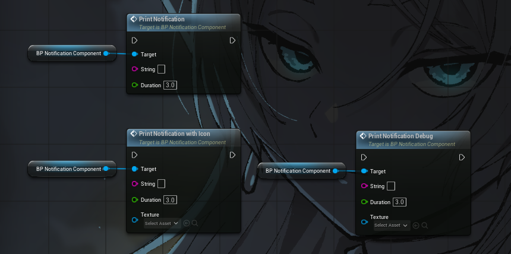
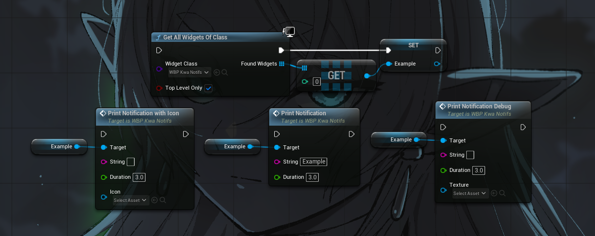
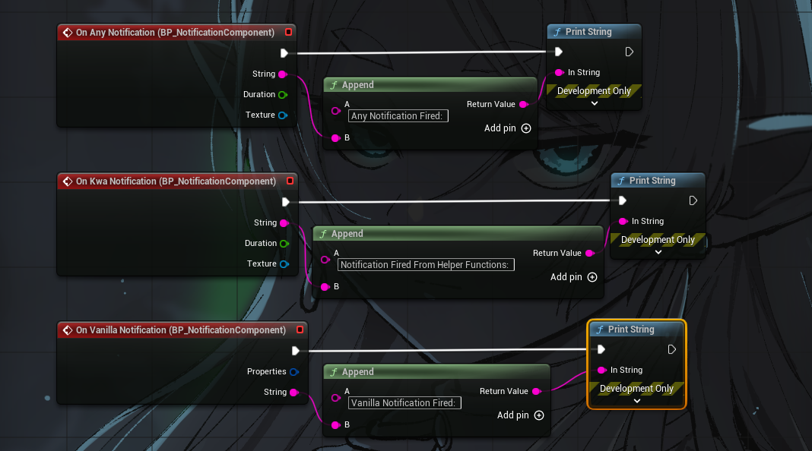

## Kwa Notifications System
[UE4SS](https://github.com/UE4SS-RE/RE-UE4SS) Oblivion Remastered stacking notification mod

`Ctrl+N` to enable / disable
`Ctrl+Shift+D` to enable / disable debug messages


---

### Usage - Blueprint Via Vanilla Notification

* Install the mod
No development download required
* Add a vanilla notification, it will get processed alongside them.


---

### Usage - Blueprint Via Dummy Integration

**YOU DO NOT NEED THE WHOLE PROJECT SOURCE TO ADD NOTIFICATIONS TO YOUR BLUEPRINT MOD, JUST IF YOU WANT TO MODIFY IT**

* Install the mod
* Download a development release from the releases tab
* Add the .uassets to your project's content folder **DO NOT ADD THESE FILES TO YOUR PAK CHUNK, USE THEM AS DUMMY'S**

#### Via Component:
* Add a `BP_NotificationComponent` to your actor (remember that `ModActor` is sometimes destructed so make sure you put the component on a living actor)
* Call functions on the component
* To turn on debug messages, click the component on the list, scroll down, and click the OnReady event, when the component is ready, you can call `SetDebugMessagesEnabled`



#### Via Reference to widget:
* Get all widgets of class `WBP_KwaNotifs` on a loop until the reference is valid and store it.
* Call functions on the reference


#### Via Global Notification
* Just call `PrintNotificationSlow`

---

### Usage - Lua
* Get a reference to the WBP_KwaNotifs_C widget
* Call functions on reference

#### Lua Example:
``` Lua
RegisterConsoleCommandHandler("PrintExampleNotification", function(cmd, params, ar)
    -- Find reference
    local notif = FindFirstOf("WBP_KwaNotifs_C")
    if not notif or not notif:IsValid() then
        print("ERROR: KwaNotifs not found")
        ar:Log("ERROR: KwaNotifs not found")
        return true
    end

    -- Print Notifications
    notif:Print("Example Notification")
    notif:PrintDebug("This Won't show up without debug messages being enabled")
    notif:SetDebugMessagesEnabled(true) -- This enables debug messages, or press ctrl-shift-D
    notif:PrintDebug("This debug message shows up!")


    -- If you want to print notifications with a set length:
    notif:PrintNotification("Long Notification", 10)
    notif:PrintNotificationDebug("Long Debug Notification", 10)
    --you can also print notifications with icons with a Texture2d object reference: 
    --notif:PrintNotificationWithIcon(String, Duration, TextureObject)


    print("Sent notifications...")
    ar:Log("Sent notifications...")
    return true
end)
```

---

### Notification Component and WBP\_KwaNotifs

The core of the system is comprised of the `BP_NotificationComponent` and the `WBP_ModEntryPoint` widget blueprint. These classes provide the following functions for managing notifications:

* **PrintNotification**: Prints a standard notification message to the notification list.
* **PrintNotificationWithIcon**: Prints a notification message that can optionally include an icon. This function is safe to use even without providing an icon.
* **PrintNotificationDebug**: Prints a notification message only when debug messages are explicitly enabled.
* **SetDebugMessagesEnabled**: Configures whether debug messages are enabled. This function should ideally be used in conjunction with the `OnReady` event to ensure the component is properly initialized.

---

### Events


Both `BP_NotificationComponent` and `WBP_ModEntryPoint` expose several bindable delegates to react to notification events:

* **OnKwaNotification**: Called specifically when a custom notification originating from this system is posted.
* **OnAnyNotification**: Called whenever any notification is posted, including both vanilla game notifications and custom notifications from this system.
* **OnVanillaNotification**: Called specifically when a notification originating from the base game is posted.


#### Component Only Event:

* **OnReady**: This event is unique to the `BP_NotificationComponent` and is called when a valid reference to the `WBP_KwaNotifs` widget is successfully located.

---

### BPFL\_KwaNotifications

The `BPFL_KwaNotifications` Global blueprint function for triggering notifications:

* **PrintNotificationSlow**: This function finds all available references to the `WBP_KwaNotifs` widget and invokes its print message function on each, broadcasting the notification, should be used sparingly due to global widget search.

---

**Credits**  
* **Kein Altar UHT SDK Dump**  
↳ [github.com/Kein/Altar](https://github.com/Kein/Altar)  
* **UE4SS**  
↳ [github.com/UE4SS-RE/RE-UE4SS](https://github.com/UE4SS-RE/RE-UE4SS)  

